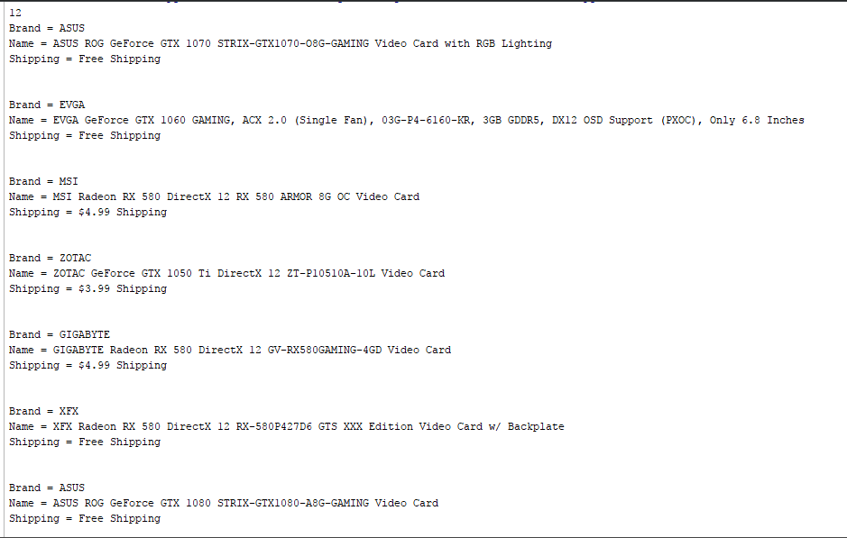

# Web-Scraping-in-Python
Web scraping in python on commercial online product selling website NewEgg.com . Here, I scrape some video card data and store it in a csv file. This program will also print the data in an organized format. 

### Here's some of the output for the program:  

